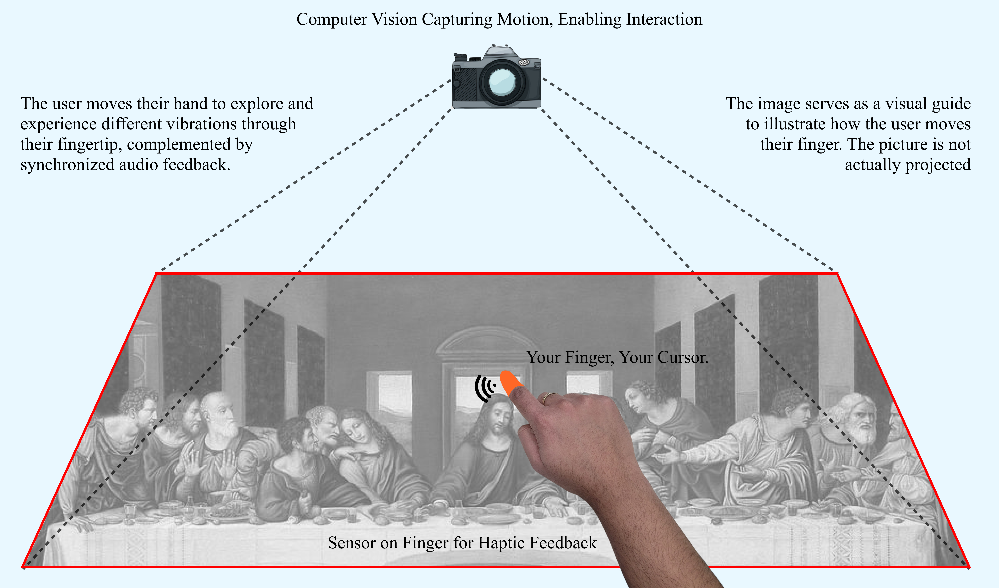
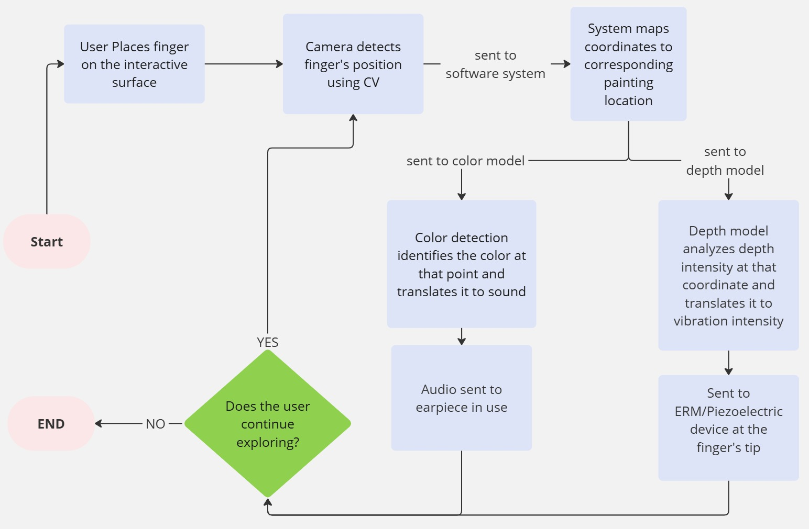
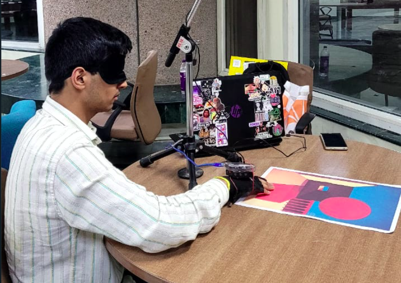

# OdinVision: Enhancing Art Perception for the Visually Impaired

OdinVision is a multimodal system designed to enhance the art-viewing experience for individuals with visual impairments using computer vision, depth map generation, and real-time haptic and auditory feedback.

This repository documents a complete, low-cost, explainable, and interactive system for **experiencing 2D visual art through sound and touch**.

### Technologies Used

- **Computer Vision**
  - Uses **MediaPipe Hands** for real-time fingertip tracking.
  - Extracts (x, y) coordinates mapped to artwork frame for interaction reference.

- **Monocular Depth Estimation**
  - Employs the **SculptOK API** to convert 2D images into pixel-wise depth maps.
  - Normalized depth values are translated to vibration intensity for tactile feedback.

- **Machine Learning: Color Classification**
  - Implements a **K-Nearest Neighbors (KNN)** model trained on RGB samples.
  - Classifies colors into 6 core categories.
  - Each color is mapped to a unique **instrument and audio frequency**.

- **Embedded Haptic Feedback**
  - Uses **Arduino UNO** to control a **PWM-modulated ERM vibration motor**.
  - Receives real-time depth input via serial communication from the host system.
  - Delivers varying tactile sensations to the fingertip.

- **Auditory Feedback**
  - Generates real-time sound output using the Python `sounddevice` library.
  - Audio cues correspond to detected color.
  - Feedback delivered through **headphones** for immersive multisensory interaction.

- **Explainability**
  - Integrates **SHAP (Shapley Additive exPlanations)** for color model transparency.
  - Provides per-sample RGB contribution insights.

- **Conversational AI**
  - Includes a multimodal chatbot using **BLIP-2** for Visual Question Answering.
  - Uses **Mistral-7B** for natural language refinement.
  - Supports voice interaction via **Google STT** and **ElevenLabs TTS**.

**Demo Video**: [Watch on YouTube](https://youtu.be/csRf7kkVQ6w)


This project was presented at the **HCI Across Borders Workshop** at the **ACM CHI Conference on Human Factors in Computing Systems (CHI 2025)**.

- **Poster**: [View Poster (Image)](images/poster.png)
- **Event**: HCI Across Borders Workshop
- **Conference**: CHI 2025
- **Location**: Yokohama, Japan

---

## Table of Contents

- [Problem Statement](#problem-statement)
- [Project Structure](#project-structure)
- [System Overview](#system-overview)
- [Methodology and Pipeline](#methodology-and-pipeline)
- [Hardware & Software Stack](#hardware--software-stack)
- [Color and Depth Feedback](#color-and-depth-feedback)
- [Real-World Interaction](#real-world-interaction)
- [Chatbot Integration](#chatbot-integration)
- [Performance Metrics](#performance-metrics)
- [User Evaluation](#user-evaluation)
- [Limitations](#limitations)
- [Future Work](#future-work)
- [Authors](#authors)

---

## Problem Statement

Traditional artwork is inherently visual and largely inaccessible to visually impaired individuals. Current solutions—bas-reliefs, tactile graphics, and verbal descriptions—lack fidelity, interactivity, or completeness.

**OdinVision addresses this gap by:**
- Mapping color to audio cues
- Translating depth into vibrations
- Tracking finger motion in real-time
- Supporting multimodal user interaction with conversational AI

---

## Project Structure 
``` 
├── assets/                      # Sample input painting, depth map, and color map images
├── images/                      # Images for README
├── sounds/                      # Instrumental sound files mapped to different colors
├── app_ui.py                    # Gradio-based frontend for chatbot and image visualization
├── arduino.ino                  # Arduino sketch for vibration motor control
├── arduino.py                   # Python code to initialize and send PWM signals to Arduino
├── audio.py                     # Handles voice input (STT) and audio output (TTS)
├── chatbot.ipynb                # Kaggle notebook hosting the BLIP-2 + Mistral 7B chatbot
├── chatbot.py                   # Interfaces with the hosted chatbot for visual question answering
├── colour_classified.pkl        # Trained KNN model for color classification
├── colour_training_set.csv      # Dataset used for training KNN model
├── colour_classification.ipynb  # Notebook for training and generating the color classifier
├── config.py                    # Global constants and environment configurations
├── feedback.csv                 # Stores user feedback collected from the UI
├── feedback.py                  # Handles writing feedback to CSV
├── Presentation.pdf             # Final project presentation slides
├── README.md                    # Project overview and documentation
├── Report.pdf                   # Detailed final report with methodology and findings
├── vision.py                    # Core computer vision logic: detection, depth map, and color classification
└── main.py                      # Entry point for launching the application
```
---

## System Overview

The system uses a camera to track finger movement, maps the finger position to artwork coordinates, and then:
- Converts color at that point to a sound
- Converts depth at that point to a vibration level

### Diagram: System Architecture



This diagram provides a high-level overview:
- The user explores a canvas
- A webcam captures motion
- Software interprets depth and color to give audio-haptic feedback

---

## Methodology and Pipeline

### Interaction Flow



- User places their finger on the surface
- The camera captures fingertip position via OpenCV + MediaPipe
- Coordinates are sent to:
  - **Color model** (KNN classifier) to identify RGB and play sound
  - **Depth model** to retrieve corresponding vibration intensity
- Color info is sonified
- Depth is mapped to vibration
- The process loops as long as the user continues exploring

---

## Hardware & Software Stack

**Software:**
- OpenCV (image processing)
- MediaPipe Hands (finger tracking)
- Scikit-learn (KNN classifier for color)
- SoundDevice (audio playback)
- SculptOK API (depth map)
- BLIP-2 + Mistral-7B (chatbot integration)
- Google STT and ElevenLabs TTS

**Hardware:**
- Arduino UNO
- ERM vibration motor
- Webcam
- Breadboard, jumper wires
- Headphones

---

## Color and Depth Feedback

### Depth Feedback Implementation


The images show:
- Left: no vibration (flat surface)
- Right: increased vibration (detected bump near nose)

The Python code captures fingertip position and sends the corresponding vibration intensity (scaled from depth value) to Arduino.

### Color Sonification

Color is classified using KNN on RGB values. Each color maps to a musical note:
- Red → Guitar
- Blue → Flute
- Green → Congo
- Yellow → Piano
- Black → Saxophone
- White → No sound

---

## Real-World Interaction

### Live Exploration Demo

### Evaluation Participant

A participant using the glove during testing. The webcam tracks movement while the glove delivers haptic feedback. Audio is delivered via headphones.



---

## Chatbot Integration

We incorporated a two-stage conversational AI system:
- **BLIP-2** interprets image-question pairs for Visual Question Answering (VQA)
- **Mistral-7B** refines the answer and provides contextually rich explanations

Supported by:
- Google Speech-to-Text (for voice input)
- ElevenLabs Text-to-Speech (for voice output)

This empowers visually impaired users to ask questions about what they are exploring and receive spoken responses.

---

## Performance Metrics

| Component            | Metric         | Value    |
|---------------------|----------------|----------|
| KNN Color Classifier| Accuracy       | 97.2%    |
|                     | F1 Score       | 0.9715   |
| MediaPipe Hand Track| Precision      | 1.00     |
|                     | Recall         | 0.674    |
| STT (Google)        | Word Error Rate| ~8%      |
| TTS (11Labs)        | MOS Score      | 4.2–4.5  |

---

## User Evaluation

- **Participants**: 10 sighted users, blindfolded
- **Task**: Explore artwork using system and reproduce it
- **Findings**:
  - Color identification was highly accurate
  - Shape recognition was approximate
  - 72% users preferred this over passive listening
  - Most rated clarity of haptic feedback 3/5 or 4/5

---

## Limitations

- ERM motors are not capable of rendering fine-grained texture
- Evaluations were conducted on blindfolded sighted individuals
- Color palette limited to six fixed categories
- Lighting variations affect color classification accuracy

---

## Future Work

- Upgrade haptics using LRAs or piezoelectric actuators
- Sonify continuous color gradients using ambient soundscapes
- Integrate detailed artwork metadata for learning
- Develop museum-ready multi-user version with spatial narration

---

## Authors

- **Adya Aggarwal** – IIIT-Delhi  
- **Pankhuri Singh** – IIIT-Delhi  
- **Pranav Jain** – IIIT-Delhi  

